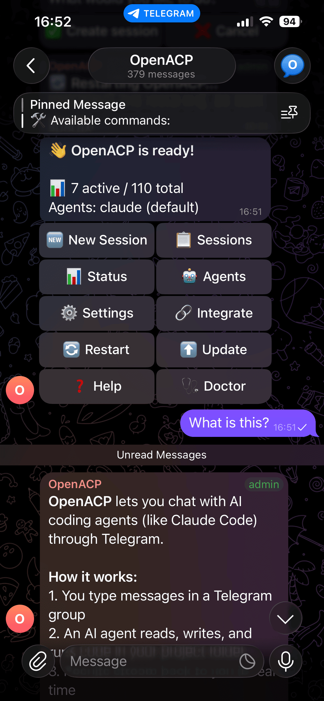
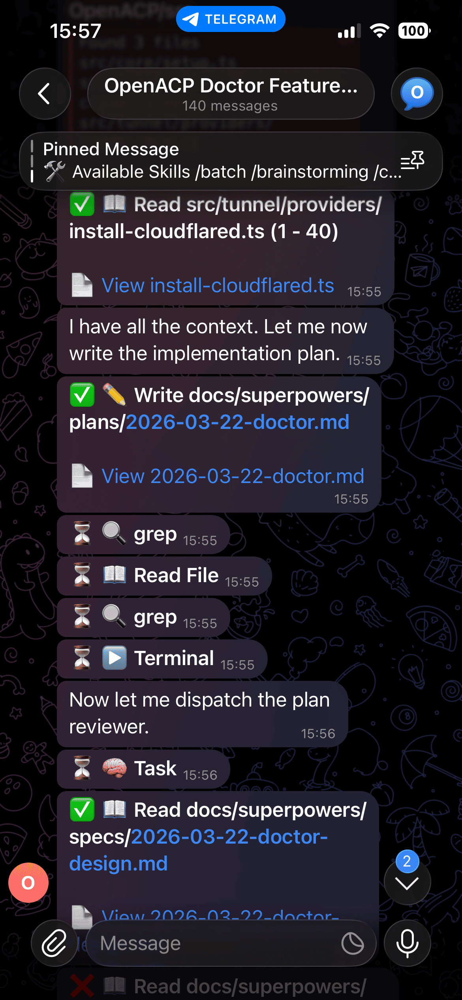
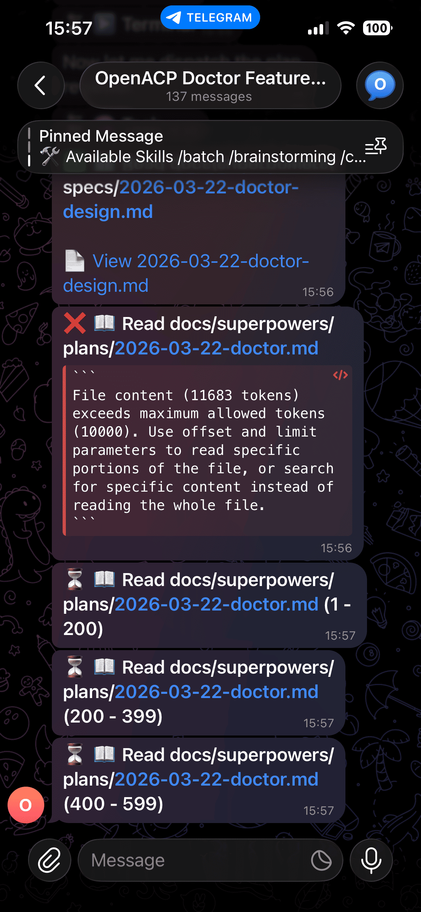
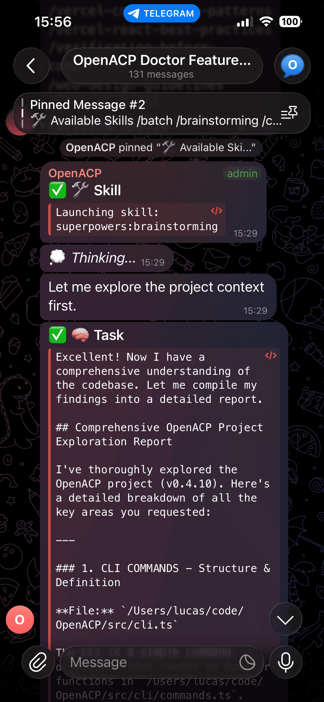

<div align="center">

# OpenACP

**Self-hosted bridge between messaging platforms and AI coding agents**

One message, any channel, any agent.

[](LICENSE)
[](https://nodejs.org/)
[](https://agentclientprotocol.org/)
[](https://www.npmjs.com/package/@openacp/cli)
[](https://x.com/Open_ACP)

[Getting Started](docs/guide/getting-started.md) | [Agents](docs/guide/agents.md) | [Usage](docs/guide/usage.md) | [Configuration](docs/guide/configuration.md) | [Tunnel](docs/guide/tunnel.md) | [Plugins](docs/guide/plugins.md) | [Development](docs/guide/development.md)

</div>

---

## What is OpenACP?

OpenACP lets you control AI coding agents (Claude Code, Codex, ...) from messaging apps like Telegram. You send a message, the agent writes code, runs commands, and streams everything back — in real time.

It uses the [Agent Client Protocol (ACP)](https://agentclientprotocol.org/) to talk to agents. You host it on your own machine, so you own the data.

```
You (Telegram / Discord / ...)
  ↓
OpenACP ─── ChannelAdapter ─── Session Manager ─── Session Store
  ↓                                                     ↓
ACP Protocol (JSON-RPC / stdio)                  Tunnel Service
  ↓                                                     ↓
AI Agent (Claude Code, Codex, ...)            File/Diff Viewer
```

## Screenshots

<div align="center">
<table>
<tr>
<td align="center"><br /><b>Control Panel</b><br />Manage sessions, agents, and settings</td>
<td align="center"><br /><b>Agent at Work</b><br />Plans, reads files, writes code</td>
</tr>
<tr>
<td align="center"><br /><b>Real-time Tool Calls</b><br />See every action the agent takes</td>
<td align="center"><br /><b>Agent Skills</b><br />Brainstorming, TDD, debugging & more</td>
</tr>
</table>
</div>

## Supported Agents

OpenACP follows the [Agent Client Protocol (ACP)](https://agentclientprotocol.com/) standard — an open protocol for connecting AI coding agents to client applications. Agent definitions are loaded from the [official ACP Registry](https://agentclientprotocol.com/get-started/registry) via CDN ([`registry.json`](https://cdn.agentclientprotocol.com/registry/v1/latest/registry.json)), so new agents are available as soon as they're registered.

| Agent | Distribution | Description |
|-------|-------------|-------------|
| [Claude Agent](https://github.com/anthropics/claude-code) | npx | Anthropic's Claude coding agent |
| [Gemini CLI](https://github.com/google-gemini/gemini-cli) | npx | Google's official CLI for Gemini |
| [Codex CLI](https://github.com/openai/codex) | npx | OpenAI's coding assistant |
| [GitHub Copilot](https://github.com/github/copilot-cli) | npx | GitHub's AI pair programmer |
| [Cursor](https://www.cursor.com/) | binary | Cursor's coding agent |
| [Cline](https://github.com/cline/cline) | npx | Autonomous coding agent with file editing, commands, and browser |
| [goose](https://github.com/block/goose) | binary | Open source AI agent for engineering tasks |
| [Amp](https://github.com/tao12345666333/amp-acp) | binary | The frontier coding agent |
| [Auggie CLI](https://www.augmentcode.com/) | npx | Augment Code's agent with industry-leading context engine |
| [Junie](https://www.jetbrains.com/) | binary | AI coding agent by JetBrains |
| [Kilo](https://github.com/kilocode/kilo) | npx | The open source coding agent |
| [Qwen Code](https://github.com/QwenLM/qwen-code) | npx | Alibaba's Qwen coding assistant |
| [crow-cli](https://github.com/crowdecode/crow-cli) | uvx | Minimal ACP native coding agent |
| ...and more | | [See full registry →](https://agentclientprotocol.com/get-started/registry) |

> **28+ agents supported** — any agent registered in the ACP Registry works out of the box. Install with `openacp agents install <name>` or browse from Telegram with `/agents`.

## Features

- **Multi-agent** — Claude Code, Codex, Gemini, Cursor, and [28+ ACP-compatible agents](#supported-agents)
- **Telegram** — Forum topics, real-time streaming, permission buttons, skill commands
- **Tunnel & file viewer** — Public file/diff viewer via Cloudflare, ngrok, bore, or Tailscale
- **Session persistence** — Resume sessions across restarts
- **Plugin system** — Install channel adapters as npm packages
- **Structured logging** — Pino with rotation, per-session log files
- **Self-hosted** — Your keys, your data, your machine

## Setup

### Prerequisites

- **Node.js 20+**
- **A Telegram bot** — Create one via [@BotFather](https://t.me/BotFather) and save the token
- **A Telegram supergroup** with Topics enabled — Add your bot as admin

### Install & first run

```bash
npm install -g @openacp/cli
openacp
```

> **Important: `openacp` is an interactive CLI.**
> The first run launches a setup wizard that asks you questions in the terminal (bot token, group selection, workspace path, etc.).
> You **must run it yourself in a terminal** — it cannot be run by a script or an AI agent because it requires interactive input.

The wizard will:

1. **Ask for your Telegram bot token** — validates it against the Telegram API
2. **Auto-detect your group** — send "hi" in the group and it picks it up, or enter the chat ID manually
3. **Set a workspace directory** — where agents will create project folders (default: `~/openacp-workspace`)
4. **Detect installed agents** — finds Claude Code, Codex, etc.
5. **Choose run mode** — foreground (in terminal) or background (daemon with auto-start)

Config is saved to `~/.openacp/config.json`. After setup, OpenACP starts automatically.

### Running after setup

```bash
# Foreground (shows logs in terminal)
openacp

# Or as a background daemon
openacp start
openacp stop
openacp status
openacp logs
```

### Other CLI commands

```bash
# Agent management
openacp agents                    # List all agents (installed + available)
openacp agents install <name>     # Install an agent from the ACP Registry
openacp agents uninstall <name>   # Remove an installed agent
openacp agents info <name>        # Show agent details & dependencies
openacp agents refresh            # Force-refresh the registry

# System
openacp config            # Show current config
openacp reset             # Re-run the setup wizard
openacp update            # Update to latest version
openacp install <plugin>  # Install a plugin (e.g. @openacp/adapter-discord)
openacp uninstall <plugin>
openacp plugins           # List installed plugins
```

## Usage

Once OpenACP is running, control it from Telegram:

| Command | Description |
|---------|-------------|
| `/new [agent] [workspace]` | Create a new session |
| `/newchat` | New session, same agent & workspace |
| `/cancel` | Cancel current session |
| `/status` | Show session or system status |
| `/agents` | Browse & install agents from ACP Registry |
| `/install <name>` | Install an agent directly |

Each session gets its own forum topic. The agent streams responses in real time, shows tool calls, and asks for permission when needed.

### Session Transfer

Move sessions between your terminal and Telegram:

**Terminal → Telegram:**
```bash
# Install integration (one-time)
openacp integrate claude

# In Claude CLI, type /openacp:handoff to transfer the current session
# Or manually:
openacp adopt claude <session_id> --cwd /path/to/project
```

**Telegram → Terminal:**
Type `/handoff` in any session topic. The bot replies with a command you can paste in your terminal to continue.

Sessions are not locked after transfer — you can continue from either side.

## Roadmap

- **Phase 1** — Core + Telegram + ACP agents
- **Phase 2** — Tunnel/file viewer, session persistence, logging, plugin system
- **Phase 3** — Agent skills as commands, Discord adapter, Web UI
- **Phase 4** — Voice control, file/image sharing
- **Phase 5** — WhatsApp, agent chaining, plugin marketplace

## Star History

<a href="https://star-history.com/#Open-ACP/OpenACP&Date">
 <picture>
   <source media="(prefers-color-scheme: dark)" srcset="https://api.star-history.com/svg?repos=Open-ACP/OpenACP&type=Date&theme=dark" />
   <source media="(prefers-color-scheme: light)" srcset="https://api.star-history.com/svg?repos=Open-ACP/OpenACP&type=Date" />
   
 </picture>
</a>

## Contributing

See [development guide](docs/guide/development.md).

## Follow Us

[](https://x.com/Open_ACP)

## License

[MIT](LICENSE)
